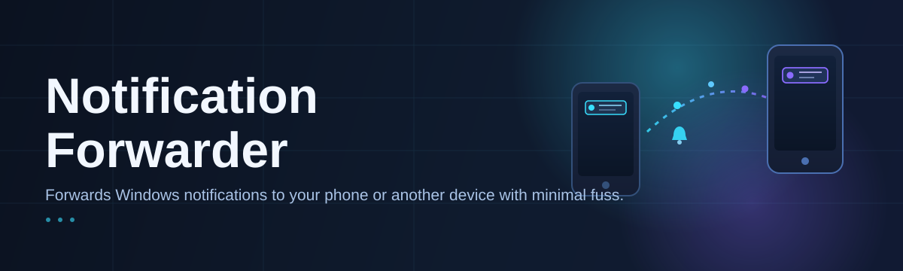
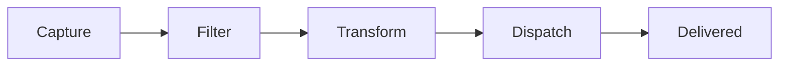

# notification-forwarder-utility 🔔📡

  

*Route every alert, toast, and ping from your Windows machine to wherever your attention actually lives.*

> [!NOTE]
> **TL;DR**
> - `notification-forwarder-utility` mirrors Windows notifications to remote endpoints (webhooks, chat apps, custom listeners) in real time.
> - It's a **standalone Windows executable** — no runtime installs, no background services fighting for resources.
> - Configure once through a clean settings panel, then forget it exists until it saves your day.

---

## 🧭 Overview

Modern desktops are noisy. Between build pipelines, chat mentions, calendar pings, and system alerts, the Windows Notification Center has become a graveyard where important things quietly die unread. **notification-forwarder-utility** exists to break that cycle — it listens to the native Windows notification pipeline and re-broadcasts each event to a destination you actually check, whether that's a webhook endpoint, a self-hosted relay, or a mobile-facing integration.

This is a **notification forwarding utility** built for people who step away from their primary monitor: sysadmins watching long-running jobs, developers who want CI failures pushed straight to a phone, streamers who can't have popups on screen, or anyone running a home lab who needs a lightweight alert relay without standing up a full monitoring stack. The tool doesn't replace your notification system — it extends its reach.

Unlike heavier monitoring suites, this project stays intentionally narrow: capture, filter, forward. That focus is what keeps it fast, auditable, and easy to trust with sensitive alert content. Every design decision — from the settings UI to the forwarding engine — favors predictability over cleverness, because the last thing you want from an *alert forwarder* is an alert forwarder that misbehaves.

  

---

## ⚡ What It Actually Does

- **Live notification capture** — hooks into the Windows notification pipeline the moment a toast fires, with no polling delay and no missed events during quick bursts.

- **Multi-destination forwarding** — send the same notification to several endpoints simultaneously; a webhook and a chat relay can both receive the same event without duplicate configuration.

- **Rule-based filtering** — build allow/deny lists by app name, keyword, or urgency level so your forwarding stream only carries signal, not every calendar reminder you own.

- **Payload templating** — reshape outgoing notification data into JSON structures that match what your receiving endpoint expects, without writing a middleware service.

- **Retry-aware delivery** — failed forwards queue automatically and retry with backoff, so a flaky network blip doesn't silently drop a critical alert.

- **Zero-footprint operation** — runs as a lightweight tray-resident process; it forwards notifications, not your CPU cycles.

- **Local-first configuration** — all settings and rules are stored on your machine; nothing about your forwarding rules is uploaded anywhere by the tool itself.

- **Session-aware pausing** — auto-suspend forwarding during screen-share or focus sessions, then resume the moment the session ends.

> [!TIP]
> Pair **rule-based filtering** with **payload templating** to build a "quiet by default, loud when it matters" setup — forward only `error`, `critical`, or `build-failed` tagged notifications while everything else stays local.

---

## 🚀 Getting Started

<strong>Click to expand: from zero to your first forwarded notification</strong>

 

1. **Visit the landing page.** Head to the project's GitHub Pages site (linked via the download button below) — this is the only official distribution point.

2. **Download the executable.** Grab the latest build for Windows. No installer wizard, no bundled extras — just the `.exe`.

3. **Run it.** Double-click to launch. The utility opens to a first-run setup screen where you name your first forwarding destination.

4. **Add a destination and test it.** Paste your endpoint URL, send a test notification, and confirm it lands where expected. From here, tune your filtering rules as needed.

That's the whole onboarding flow. No account creation, no license key, no telemetry opt-in buried in fine print.

---

## 🖥️ System Requirements

<strong>Click to expand: platform details</strong>

 

| Requirement | Detail |
|---|---|
| **OS** | Windows 10 (21H2+) or Windows 11 |
| **Architecture** | x64 |
| **Dependencies** | None — fully standalone binary |
| **Disk space** | Under 50 MB |
| **Network** | Outbound access to your configured forwarding endpoints |
| **Permissions** | Standard user; no administrator rights required for basic operation |

  

> [!IMPORTANT]
> This is a **Windows-only** notification forwarding utility. It relies on the Windows Notification Platform (WNP) and does not run on macOS or Linux.

---

## 🔄 How It Works

The forwarding pipeline follows a deliberately short path — fewer hops means fewer places for a notification to get lost.

1. **Capture** — the utility subscribes to the Windows notification listener API and receives each toast event as it fires.
2. **Filter** — incoming events are checked against your configured rules (app name, keyword, priority).
3. **Transform** — matching events are mapped into your chosen payload template.
4. **Dispatch** — the payload is sent to one or more destinations, with retry logic on failure.
5. **Confirm** — a delivery status is logged locally so you can audit what went out and when.

> [!NOTE]
> Filtering happens **before** transformation, so denied notifications never even reach the templating engine — keeping the hot path lean.

---

## 🧩 Troubleshooting

<strong>Click to expand: common questions and fixes</strong>

 

**Q: My notifications aren't being forwarded at all.**
A: Confirm the app you're expecting alerts from is not on your deny list, and check that Windows notification permissions for that app are enabled in system settings.

**Q: Forwarding worked, then stopped after a Windows update.**
A: Windows updates occasionally reset notification listener permissions. Reopen the utility's settings panel and re-grant access when prompted.

**Q: My webhook endpoint says the payload format is wrong.**
A: Check your payload template under destination settings — most format errors trace back to a missing field mapping rather than a delivery issue.

**Q: Notifications forward twice.**
A: This usually means the same app is matched by two overlapping rules. Review your rule list for duplicate or conflicting entries.

**Q: The tray icon disappeared.**
A: Windows sometimes hides tray icons by default. Check the hidden icons overflow menu, then pin it for persistent visibility.

**Q: Can I forward notifications while my laptop is on battery saver?**
A: Yes, but aggressive battery-saving modes may throttle background processes. Exclude the utility from battery optimization if delivery feels delayed.

---

## 🎨 Interface & Experience

<strong>Click to expand: shortcuts, themes, and settings</strong>

 

- **Themes** — Light, Dark, and a System-synced mode that follows your Windows accent color.
- **Keyboard shortcuts:**

| Shortcut | Action |
|---|---|
| `Ctrl + N` | Add new forwarding destination |
| `Ctrl + ,` | Open settings panel |
| `Ctrl + T` | Send a test notification |
| `Ctrl + Shift + P` | Pause all forwarding |
| `Ctrl + L` | Open delivery log |

- **Tray behavior** — minimizes to tray by default; a single click reveals recent forward history.
- **Notification log** — a scrollable, searchable record of every forwarded event with delivery status.

> [!WARNING]
> Disabling the delivery log improves performance marginally but removes your ability to audit missed or failed forwards. Turn it off only if you're confident in your endpoint's reliability.

---

## 🤝 Contributing & Community

This project grows from real-world usage, so issue reports and pull requests describing actual forwarding scenarios are the most valuable kind of contribution.

- Open an issue for bugs, with your Windows build number and a description of the notification source involved.
- Propose new payload templates or destination integrations via pull request.
- Join discussions to share filtering rule setups that work well for your workflow.

> [!TIP]
> When filing a bug, include a sample of the (redacted) payload your destination received — it dramatically speeds up diagnosis.

---

## 📄 License

Released under the [MIT License](LICENSE), 2026.

---

## ⚠️ Disclaimer

`notification-forwarder-utility` is provided as-is, for legitimate personal and organizational notification-routing purposes. Users are responsible for ensuring their forwarding destinations comply with applicable data handling and privacy obligations. The maintainers assume no liability for missed, delayed, or misrouted notifications resulting from third-party endpoint outages, network conditions, or misconfiguration.

  

